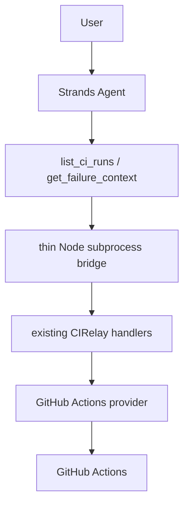

# AWS Agents for Humans hackathon: Strands CI agent

This first hackathon integration adds one focused [Strands Agents SDK](https://strandsagents.com/) agent that turns a natural-language CI question into a CIRelay investigation. It is a thin consumer, not a change to CIRelay's CI intelligence.

## What is new and what is reused

**Pre-existing work:** CIRelay core, GitHub Actions provider, MCP server/tooling, deterministic failure extraction, and the evidence-first workflow existed before this hackathon submission.

**New hackathon work:** the Strands Agent, its two-tool CIRelay adapter, the CLI/demo flow, and this document. No AgentCore, hosted service, UI, or general execution tool is included.



## Setup and demo

Requirements are Node.js 22+, pnpm, Python 3.11+, and a GitHub token with Actions read access. Bedrock is the intended and default AWS hackathon provider; it uses AWS credentials from the standard credential chain.

Install the shared dependencies first:

```sh
pnpm install
pnpm build
python -m venv .venv
. .venv/bin/activate
python -m pip install -e './apps/strands-agent'
export GITHUB_TOKEN='<github-token>'
```

### Preferred AWS Bedrock path

```sh
export STRANDS_MODEL_PROVIDER=bedrock
export AWS_REGION='us-east-1'
# Optional; this is the default Bedrock model:
export STRANDS_MODEL_ID='us.amazon.nova-pro-v1:0'
python -m cirelay_strands_agent \
  "Investigate the latest failed CI for WaterMelonKnight/CIRelay and tell me the root cause and what I should inspect next."
```

`STRANDS_MODEL_PROVIDER` defaults to `bedrock`, so setting it explicitly is optional. AWS authentication and `AWS_REGION` configure Bedrock; `STRANDS_MODEL_ID` is optional.

### Local OpenAI fallback validation

The alternate provider allows the same Strands+CIRelay agent loop to be validated while AWS Bedrock account access is pending. OpenAI is a separate, non-AWS provider; Bedrock remains the intended/default hackathon path.

```sh
export STRANDS_MODEL_PROVIDER=openai
export OPENAI_API_KEY='<openai-api-key>'
# Optional; the default is gpt-4o-mini:
export STRANDS_MODEL_ID='<model-id>'
python -m cirelay_strands_agent \
  "Investigate the latest failed CI for WaterMelonKnight/CIRelay and tell me the root cause and what I should inspect next."
```

Provider selection is explicit and does not automatically fall back after a Bedrock error. It changes neither CIRelay core nor the two CIRelay tools or their bridge behavior. Credentials are never passed as tool arguments or hardcoded.

## Expected workflow

The agent interprets the request, calls `list_ci_runs` to resolve a failed run, and calls `get_failure_context` with the resulting run ID. It stops when that bounded evidence is sufficient, clearly separates **Observed evidence** from **Agent inference**, and gives a concise next action. This first adapter intentionally exposes neither full-log retrieval nor shell/Python execution tools.
