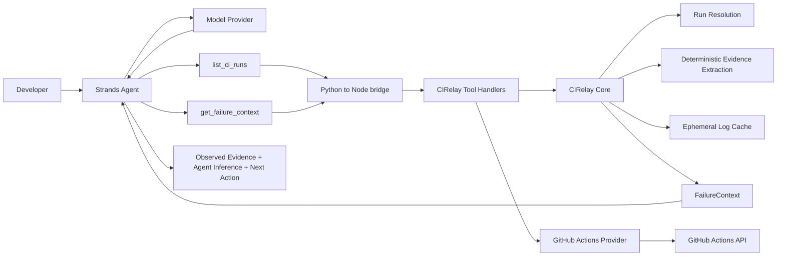

# CIRelay Strands CI Agent

**Evidence-first CI failure investigation for software developers and AI coding agents.**

**AWS Agents for Humans 2026 track:** Professional Agents

## Problem

AI coding agents can change code, but CI failure investigation is still noisy. A naive workflow requires an agent to:

- locate the correct workflow run;
- find failed jobs and steps;
- download potentially large raw logs;
- search those logs;
- determine which lines matter; and
- infer a root cause.

That work is repeated across agents and consumes context and tokens. CIRelay Strands CI Agent turns it into a reusable, evidence-first workflow that gives the agent bounded CI evidence before it makes a semantic inference.

## Who it is for

The submission is for:

- software developers;
- AI coding-agent users; and
- developer-tool and CI workflows.

It is entered in the **Professional Agents** track.

## What the agent does

1. A user asks a natural-language CI investigation question.
2. Strands decides to call `list_ci_runs`.
3. The relevant failed CI run is resolved.
4. Strands calls `get_failure_context`.
5. CIRelay obtains structured CI evidence.
6. The agent evaluates that evidence.
7. Its final response separates **Observed evidence**, **Agent inference**, and **Next action**.

Tool invocation is controlled by the Strands agent loop. The CLI does not hard-code this sequence. The agent provides an evidence-backed diagnosis and next action; it does not autonomously fix or push code.

## Architecture



The dependency direction preserves CIRelay's provider-neutral core:

- `apps/strands-agent` is an outer adapter that owns the Strands integration and demo.
- `packages/mcp` exposes the existing CIRelay handlers and tool semantics reused by the bridge.
- `packages/github` maps GitHub Actions data into provider-neutral CIRelay types.
- `packages/core` does not depend on Strands, GitHub-specific payloads, MCP, Bedrock, OpenAI, or DeepSeek.

## Why evidence-first

CIRelay's preferred investigation policy is:

```text
list_ci_runs
    -> get_failure_context
    -> stop if evidence is sufficient
    -> targeted search only when required
    -> full raw log only as a final fallback
```

The focused hackathon Strands adapter exposes only the first two tools. This provides a smaller tool surface, avoids unnecessary raw-log retrieval, bounds context, makes the separation between evidence and inference clearer, and reduces the privilege/action surface.

Full raw-log and targeted-search tools have **not** been removed from CIRelay. They remain available in the normal MCP product; they simply are not exposed to this hackathon agent.

## Real end-to-end validation

A real end-to-end run completed successfully using this flow:

```text
natural-language request
    -> Strands Agent
    -> list_ci_runs
    -> get_failure_context
    -> GitHub Actions data
    -> structured FailureContext
    -> developer-facing diagnosis
```

The demonstrated failure was concise and concrete:

- **Workflow:** `CI`
- **Job:** `validate`
- The build succeeded.
- Lint failed with `@typescript-eslint/no-unsafe-assignment` in `packages/mcp/src/server.test.ts`.
- Downstream gates were skipped because lint failed.
- The agent correctly distinguished that skipped tests are **not** evidence of failed tests.

A representative answer identified the lint error as observed evidence, treated its explanation as agent inference, and recommended inspecting the unsafe assignment in the named test file as the next action. The final answer explicitly separated **Observed evidence**, **Agent inference**, and **Next action**.

## Demo command

After completing the quick start below, run:

```sh
python -m cirelay_strands_agent \
  "Investigate the latest failed CI for WaterMelonKnight/CIRelay and tell me the root cause and what I should inspect next."
```

### AWS-oriented/default path

```sh
export STRANDS_MODEL_PROVIDER=bedrock
export AWS_REGION='<aws-region>'
export STRANDS_MODEL_ID='<bedrock-model-id>'
```

Bedrock is the adapter's default AWS-oriented model path. During hackathon development, the development AWS account reached Bedrock, but model invocation was blocked by account-level compliance/allowlisting. This was neither an IAM bug nor a CIRelay bug, and a Bedrock end-to-end run is not claimed.

### Demonstrated working path

The recorded and validated end-to-end demo used:

```sh
export STRANDS_MODEL_PROVIDER=openai
export OPENAI_BASE_URL='https://api.deepseek.com'
export OPENAI_API_KEY='<deepseek-api-key>'
export STRANDS_MODEL_ID='deepseek-v4-flash'
```

This configuration uses DeepSeek through an OpenAI-compatible API path supported by the current Strands OpenAI model adapter. OpenAI's hosted API was not used, DeepSeek is not an AWS service, and Strands remains the agent runtime and agent loop. Provider selection is explicit; credentials are supplied through environment variables and are not passed as tool arguments.

## What Strands owns vs. what CIRelay owns

| Strands Agent                       | CIRelay                                    |
| ----------------------------------- | ------------------------------------------ |
| Interprets natural language         | Resolves CI runs                           |
| Selects tools                       | Retrieves CI jobs, steps, and log data     |
| Decides when evidence is sufficient | Performs deterministic evidence extraction |
| Produces semantic inference         | Creates `FailureContext`                   |
| Generates the next action           | Preserves provider-neutral boundaries      |
| Owns the agent loop                 | Does not run an LLM inside core            |

The model working through Strands interprets the evidence; CIRelay retrieves and reduces it deterministically.

## Pre-existing work disclosure

CIRelay existed as an open-source CI feedback infrastructure project before the AWS Agents for Humans submission period.

**Pre-existing components reused by the submission:**

- provider-neutral CIRelay core;
- GitHub Actions provider;
- MCP server and existing tool handlers;
- deterministic CI log/evidence extraction;
- `FailureContext` domain model; and
- existing evidence-first CIRelay workflow.

**New hackathon-specific work:**

- Strands Agents-based CI investigation agent;
- focused Strands tool surface: `list_ci_runs` and `get_failure_context`;
- Python-to-Node bridge reusing existing CIRelay handlers;
- CLI demo flow;
- Strands model-provider configuration for the demo;
- Bedrock default integration path;
- configurable OpenAI-compatible fallback path used for validation;
- DeepSeek-compatible demo polish; and
- hackathon-specific tests, documentation, and demo workflow.

The submitted hackathon project is the new CIRelay Strands CI Agent built on top of the pre-existing CIRelay open-source infrastructure. The submission does not represent the entire repository as hackathon-period work.

## Current limitations

- GitHub Actions is the implemented CI provider.
- The current main CIRelay deployment model is local stdio MCP.
- The Strands hackathon adapter uses a thin Python-to-Node subprocess bridge.
- The raw-log cache is process-local and ephemeral.
- There is no hosted multi-tenant service or persistent historical failure database.
- There is no completed webhook push path, failure fingerprinting, or automatic diff correlation yet.
- There is no AgentCore deployment.
- Bedrock end-to-end validation could not be completed on the development account because of account-level allowlisting/compliance.

## What's next

The primary next step is **failure fingerprinting**. Later directions are similar historical failures, last-success comparison, stronger diff/code-change correlation, persistent history, event-driven/webhook delivery, and additional CI providers such as GitLab CI, Jenkins, and Buildkite. These are roadmap items, not implemented features.

## Judge-friendly quick start

Requirements:

- Node.js 22 or newer;
- pnpm;
- Python 3.11 or newer;
- a GitHub token with the required Actions read access; and
- a configured Strands model provider.

From a source checkout:

```sh
corepack enable
pnpm install --frozen-lockfile
pnpm build
python -m venv .venv
. .venv/bin/activate
python -m pip install -e './apps/strands-agent'
export GITHUB_TOKEN='<github-token>'
```

Configure either model-provider path above, then run the [demo command](#demo-command). Do not commit or paste real credentials.
