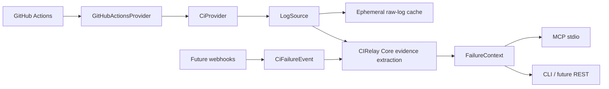

# Architecture

## Principles

CIRelay translates CI-provider information into a small neutral domain. Core performs deterministic extraction only: it does not know about GitHub or MCP and it never invokes a model. Adapters depend inward on core, while transports operate against `CiProvider`.

## Packages

- `packages/core`: provider-neutral references, run/job/step models, `CiProvider`, evidence extraction, and `FailureContext` construction. Its only runtime dependency is Zod, reserved for neutral schemas as they evolve.
- `packages/github`: translates GitHub Actions API payloads to core types. Octokit and token authentication stop at this boundary.
- `packages/mcp`: official MCP SDK stdio transport and tool handlers. Handlers receive any `CiProvider`; only the executable chooses GitHub.
- `packages/cli`: deliberately small command entry point.
- `apps/webhook-server`: future push-mode boundary. M0 provides health behavior and provider-event parsing, but no signature verification or delivery endpoint.

## Run resolution and failure context

Core owns provider-neutral `CiRunQuery` validation, deterministic run ordering,
and selection. Providers expose only primitives: exact run lookup, filtered run
listing, and (optionally) pull-request reference lookup. For GitHub, PR lookup
produces a head SHA before Actions runs are listed; MCP merely transports the
neutral query. Detailed ordering and ambiguity rules are documented in
[CI run queries](run-queries.md).

`buildFailureContext` loads a neutral run and its jobs, selects failed jobs, retrieves
their raw logs through `LogSource`, and extracts error lines and stack-like
candidates using deterministic patterns. The provider remains responsible for
remote transport; `LogSource` owns raw-log cache and freshness policy; evidence
extraction remains independent of both. Failure context includes PR changed files
when the provider supports them. This is evidence, not diagnosis.

## Raw job-log retrieval

The default cached log source uses a provider-neutral key consisting of provider
name, repository owner and name, and job ID. Its policies are:

- `prefer-cache`: use a cached raw log, or fetch it from the provider and cache it.
- `cache-only`: use a cached raw log or return a typed `cache-miss` error without
  calling the provider.
- `refresh`: fetch from the provider and replace the cached value.

This supports a repeated investigation loop: an initial `get_failure_context`
downloads and caches failed-job logs before extracting evidence; another call with
`prefer-cache` re-extracts evidence from those raw logs; `cache-only` explicitly
requires local reuse; and `refresh` reloads the selected job logs.

The cache stores raw logs, not `FailureContext` objects. It is process-local,
memory-only, ephemeral, and cleared by a CIRelay restart. Logs are not persisted
to disk or copied to secondary remote storage. Because CI logs can contain
secrets, any future persistent implementation must define appropriate secret
handling and retention policy before adoption.

`sourcePolicy` controls only retrieval of logs for jobs in the selected run. Run
and query resolution is not cached: for example, a PR query with `latest: true`
can still contact the provider to select its current run before `refresh` forces
fresh retrieval of that run's job logs.

Future fingerprinting, last-success comparison, historical matching, framework parsers, and diff correlation can enrich the structure without changing provider boundaries.

## Deliberate limitations

M0 requests only the first GitHub API page and exposes underlying API failures. Job-log responses vary across clients and redirects; the adapter supports text and byte responses but M1 should add integration tests and explicit error handling. The webhook server does not accept or authenticate events yet.
